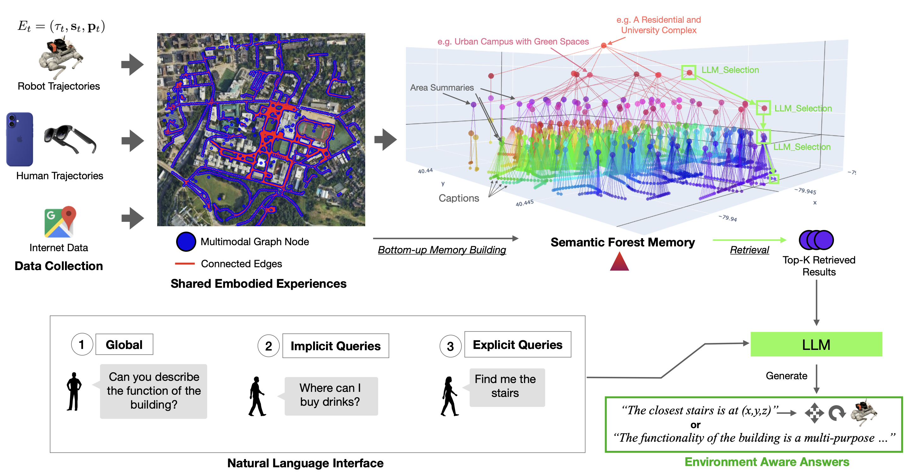
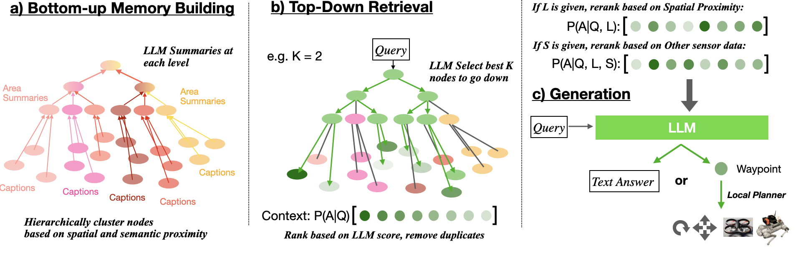
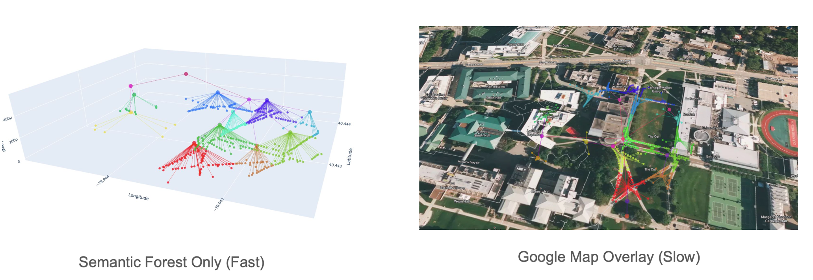

<p align="center">
<h1 align="center"><strong>Embodied-RAG: General Non-parametric Embodied Memory for Retrieval and Generation</strong></h1>
  <p align="center">
    <a href='[https://quanting-xie.github.io/Embodied-RAG-web/](https://quanting-xie.github.io/Embodied-RAG-web/)' target='_blank'>Project Website</a>&emsp;
    <br>
    Carnegie Mellon University
    <br>
  </p>
</p>

<div id="top" align="center">

[](https://arxiv.org/abs/your-paper)
[](https://github.com/your-username/E-RAG)
[](https://youtube.com/your-demo)

</div>

## 🤖 Overview



## 📋 Contents

- [About](#about)
- [Getting Started](#getting-started)
- [Features](#features)
- [Usage](#usage)
- [Citation](#citation)
- [License](#license)

## Abstract

Embodied-RAG is a novel system that combines retrieval-augmented generation(RAG) with embodied navigation abd embodied question answering in physical environments. The system:

- Generates rich multimodal topological graph for physical environments
- Builds hierarchical semantic forests for efficient memorization
- Enables natural language queries for natural language and location-based retrieval



## Getting Started

### Prerequisites

- Python 3.8+
- OpenAI API key
- Google Maps API key
- Required Python packages:
```python
pip install -r requirements.txt
```

### Installation

1. Clone the repository:
```bash
git clone git@github.com:quanting-xie/embodied-rag-repo.git
cd embodied-rag-repo
```

2. Set up environment variables:
```bash
export OPENAI_API_KEY="your-key-here"
export GOOGLE_MAPS_API_KEY="your-key-here" # optional if you want to collect data from Google Street View yourself
```

## Features

### 1. Collect Data from Google Street View(optional)
```
cd data_collection
python sample_from_google_map.py    
```

### 2. Caption Generation
```
cd Embodied-RAG
python data_caption.py Tokyo
```

The system uses GPT-4o to generate detailed captions describing street view scenes, including:
- Abstract scene summaries
- Detailed environmental descriptions
- Object and signage identification

### 2. Semantic Forest Generation
```bash
python generate_semantic_forest.py --input-dir /path/to/graph --name my_forest
```

Builds hierarchical knowledge graphs that capture:
- Spatial relationships between locations
- Semantic similarities between scenes
- Multi-level abstractions for efficient retrieval



### 3. Interactive Retrieval
```bash
python evaluation.py --graph-dir /path/to/forest --vector-db /path/to/db --image-dir /path/to/images
```

Supports natural language queries with:
- Interactive visualization of results
- Distance-based relevance ranking
- Image and metadata display


## Citation

If you find our work helpful, please cite:
```bibtex
@misc{xie2025embodiedraggeneralnonparametricembodied,
      title={Embodied-RAG: General Non-parametric Embodied Memory for Retrieval and Generation}, 
      author={Quanting Xie and So Yeon Min and Pengliang Ji and Yue Yang and Tianyi Zhang and Kedi Xu and Aarav Bajaj and Ruslan Salakhutdinov and Matthew Johnson-Roberson and Yonatan Bisk},
      year={2025},
      eprint={2409.18313},
      archivePrefix={arXiv},
      primaryClass={cs.RO},
      url={https://arxiv.org/abs/2409.18313}, 
}
```

## License

This project is licensed under the MIT License - see the [LICENSE](LICENSE) file for details.